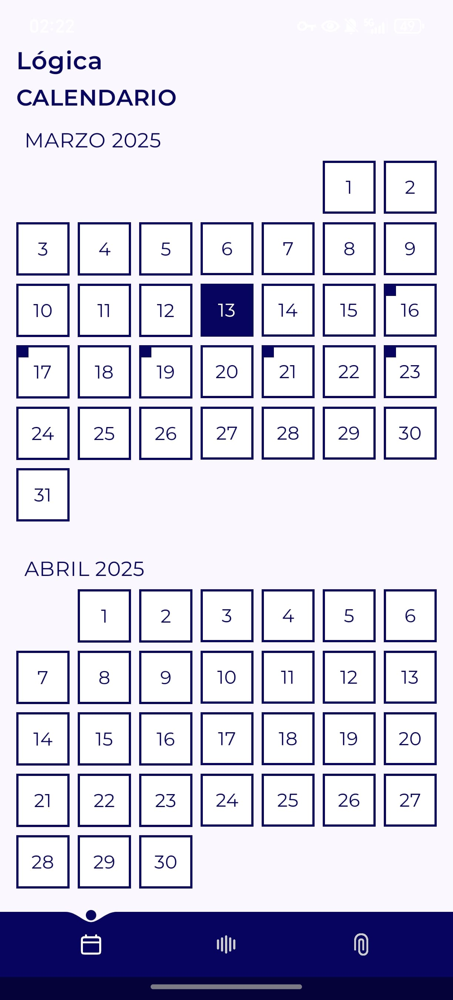

# oNote

**oNote** is a mobile application designed to transcribe university lectures in real-time, enhancing organization and access to educational content.

---

## Key Features

- **Real-time Transcription**: Utilizes the Whisper API from OpenAI with custom enhancements to improve transcription accuracy and user experience.
- **Integrated Calendar**: Allows users to schedule deadlines and reminders associated with specific subjects for better academic organization.
- **File Management System**: Users can upload and associate files with a class or subject, making them accessible to all participants.
- **Real-time chat (In Development)**: Users can chat with other users while a lecture is being transcripted in real-time.
- **Resume and Translation**: Transcriptions of lectures will be resumed and translated using OpenAI ChatGPT API.

---

## Technology Stack

### **Frontend**
- Jetpack Compose in Android Studio for a modern, reactive, and native user interface.

### **Backend**
- **Spring Boot Server**: REST API responsible for data management and integration with MongoDB.  
  [Repository here](https://github.com/ppazosp/oNoteDB)
- **MongoDB**: NoSQL database used to store information related to subjects, transcriptions, and file resources.
- **Python WebSocket Server**: Handles transcription and audio analysis using the WhisperAI API.  
  [Repository here](https://github.com/ppazosp/oNoteVoice)
- **Python Resume Server**: Handles the resume and translation of the transcripted lectures.  
  [Repository here](https://github.com/ppazosp/oNoteVoice)
- **StreamChat API**: For real-time chatting.  

---

## Screenshots

<table>
  <tr>
    <td align="center"><strong>Subjects</strong></td>
    <td align="center"><strong>Lectures</strong></td>
    <td align="center"><strong>Real-time Transcription</strong></td>
  </tr>
  <tr>
    <td align="center"></td>
    <td align="center"></td>
    <td align="center"></td>
  </tr>
  <tr>
    <td align="center"><strong>Event Calendar</strong></td>
    <td align="center"><strong>Daily Reminders</strong></td>
    <td align="center"><strong>File Repository</strong></td>
  </tr>
  <tr>
    <td align="center"></td>
    <td align="center"></td>
    <td align="center"></td>
  </tr>
</table>

---
